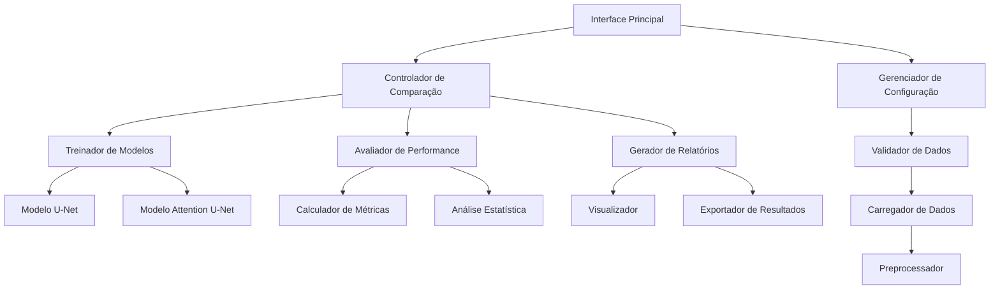

# Documento de Design - Sistema de Comparação U-Net vs Attention U-Net

## Visão Geral

O sistema será redesenhado para ser mais modular, eficiente e fácil de usar. A arquitetura atual funcional será mantida como base, mas será reorganizada em componentes bem definidos com responsabilidades claras.

## Arquitetura

### Arquitetura Geral



### Componentes Principais

#### 1. Interface Principal (`main_interface.m`)
- **Responsabilidade**: Ponto de entrada único e menu interativo
- **Funcionalidades**:
  - Menu principal simplificado
  - Validação de entrada do usuário
  - Coordenação entre componentes
  - Tratamento de erros global

#### 2. Gerenciador de Configuração (`config_manager.m`)
- **Responsabilidade**: Gerenciar todas as configurações do sistema
- **Funcionalidades**:
  - Detecção automática de caminhos
  - Validação de configurações
  - Persistência de configurações
  - Migração entre computadores

#### 3. Controlador de Comparação (`comparison_controller.m`)
- **Responsabilidade**: Orquestrar todo o processo de comparação
- **Funcionalidades**:
  - Coordenar treinamento dos modelos
  - Executar avaliações
  - Gerar relatórios finais
  - Controlar fluxo de execução

## Componentes e Interfaces

### Módulo de Dados

#### DataLoader (`data_loader.m`)
```matlab
classdef DataLoader < handle
    methods
        function [images, masks] = loadData(obj, config)
        function isValid = validateData(obj, images, masks)
        function [trainData, valData, testData] = splitData(obj, images, masks, ratios)
    end
end
```

#### DataPreprocessor (`data_preprocessor.m`)
```matlab
classdef DataPreprocessor < handle
    methods
        function processedData = preprocess(obj, data, config, isTraining)
        function augmentedData = augment(obj, data)
        function normalizedData = normalize(obj, data)
    end
end
```

### Módulo de Modelos

#### ModelTrainer (`model_trainer.m`)
```matlab
classdef ModelTrainer < handle
    methods
        function net = trainUNet(obj, trainData, valData, config)
        function net = trainAttentionUNet(obj, trainData, valData, config)
        function saveModel(obj, net, filename)
        function net = loadModel(obj, filename)
    end
end
```

#### ModelArchitectures (`model_architectures.m`)
```matlab
classdef ModelArchitectures < handle
    methods (Static)
        function lgraph = createUNet(inputSize, numClasses)
        function lgraph = createAttentionUNet(inputSize, numClasses)
        function lgraph = optimizeArchitecture(lgraph, config)
    end
end
```

### Módulo de Avaliação

#### MetricsCalculator (`metrics_calculator.m`)
```matlab
classdef MetricsCalculator < handle
    methods
        function metrics = calculateIoU(obj, pred, gt)
        function metrics = calculateDice(obj, pred, gt)
        function metrics = calculateAccuracy(obj, pred, gt)
        function allMetrics = calculateAllMetrics(obj, pred, gt)
    end
end
```

#### StatisticalAnalyzer (`statistical_analyzer.m`)
```matlab
classdef StatisticalAnalyzer < handle
    methods
        function results = performTTest(obj, metrics1, metrics2)
        function results = calculateConfidenceIntervals(obj, metrics)
        function results = performCrossValidation(obj, data, config)
    end
end
```

### Módulo de Visualização

#### Visualizer (`visualizer.m`)
```matlab
classdef Visualizer < handle
    methods
        function createComparisonPlot(obj, results1, results2)
        function createMetricsChart(obj, metrics)
        function createPredictionComparison(obj, images, pred1, pred2, gt)
        function saveVisualization(obj, figure, filename)
    end
end
```

#### ReportGenerator (`report_generator.m`)
```matlab
classdef ReportGenerator < handle
    methods
        function generateTextReport(obj, results, filename)
        function generatePDFReport(obj, results, filename)
        function generateSummary(obj, results)
    end
end
```

## Modelos de Dados

### Estrutura de Configuração
```matlab
config = struct(
    'paths', struct(
        'imageDir', '',
        'maskDir', '',
        'outputDir', ''
    ),
    'model', struct(
        'inputSize', [256, 256, 3],
        'numClasses', 2,
        'encoderDepth', 4
    ),
    'training', struct(
        'maxEpochs', 20,
        'miniBatchSize', 8,
        'learningRate', 1e-3,
        'validationSplit', 0.2
    ),
    'evaluation', struct(
        'metrics', {'iou', 'dice', 'accuracy'},
        'crossValidationFolds', 5,
        'statisticalTests', true
    ),
    'output', struct(
        'saveModels', true,
        'generateReports', true,
        'createVisualizations', true
    )
);
```

### Estrutura de Resultados
```matlab
results = struct(
    'models', struct(
        'unet', struct('net', [], 'metrics', [], 'trainingTime', 0),
        'attentionUnet', struct('net', [], 'metrics', [], 'trainingTime', 0)
    ),
    'comparison', struct(
        'winner', '',
        'significantDifference', false,
        'pValue', 0,
        'effectSize', 0
    ),
    'metrics', struct(
        'iou', struct('unet', [], 'attention', [], 'difference', []),
        'dice', struct('unet', [], 'attention', [], 'difference', []),
        'accuracy', struct('unet', [], 'attention', [], 'difference', [])
    ),
    'visualizations', struct(
        'comparisonChart', '',
        'predictionSamples', '',
        'metricsBoxplot', ''
    )
);
```

## Tratamento de Erros

### Estratégia de Tratamento de Erros

1. **Validação Preventiva**: Validar dados e configurações antes do processamento
2. **Recuperação Graceful**: Tentar recuperar de erros quando possível
3. **Fallbacks**: Implementar alternativas quando componentes falham
4. **Logging Detalhado**: Registrar todos os erros para diagnóstico

### Hierarquia de Erros
```matlab
% Classe base para erros do sistema
classdef ComparisonSystemError < MException
end

% Erros específicos
classdef DataValidationError < ComparisonSystemError
end

classdef ModelTrainingError < ComparisonSystemError
end

classdef ConfigurationError < ComparisonSystemError
end
```

## Estratégia de Testes

### Tipos de Testes

#### 1. Testes Unitários
- Testar cada função individualmente
- Validar entrada e saída de dados
- Verificar tratamento de casos extremos

#### 2. Testes de Integração
- Testar interação entre componentes
- Validar fluxo completo de dados
- Verificar persistência de configurações

#### 3. Testes de Performance
- Medir tempo de execução
- Verificar uso de memória
- Testar com diferentes tamanhos de dataset

#### 4. Testes de Regressão
- Garantir que mudanças não quebrem funcionalidades existentes
- Comparar resultados com versões anteriores
- Validar métricas de referência

### Framework de Testes
```matlab
classdef TestSuite < handle
    methods
        function runAllTests(obj)
        function results = runUnitTests(obj)
        function results = runIntegrationTests(obj)
        function results = runPerformanceTests(obj)
        function generateTestReport(obj, results)
    end
end
```

## Otimizações de Performance

### 1. Carregamento de Dados
- **Lazy Loading**: Carregar dados apenas quando necessário
- **Caching**: Cache de dados preprocessados
- **Parallel Processing**: Usar parfor para operações independentes

### 2. Treinamento de Modelos
- **GPU Acceleration**: Detecção automática e uso de GPU
- **Mixed Precision**: Usar precisão mista quando disponível
- **Early Stopping**: Parar treinamento quando não há melhoria

### 3. Avaliação
- **Batch Processing**: Processar múltiplas imagens simultaneamente
- **Vectorized Operations**: Usar operações vetorizadas do MATLAB
- **Memory Management**: Limpar variáveis desnecessárias

## Arquivos a Serem Removidos

### Arquivos Duplicados/Obsoletos
1. `README_CONFIGURACAO.md` (duplicado do README.md)
2. `GUIA_CONFIGURACAO.md` (informações já no README.md)
3. `CORRECAO_CRITICA_CONCLUIDA.md` (arquivo de status temporário)
4. `STATUS_FINAL.md` (arquivo de status temporário)
5. Múltiplos arquivos de teste similares que podem ser consolidados

### Funções Redundantes
1. Consolidar funções de cálculo de métricas similares
2. Remover implementações duplicadas de preprocessamento
3. Unificar funções de carregamento de dados

## Estrutura de Diretórios Proposta

```
projeto/
├── src/
│   ├── core/
│   │   ├── main_interface.m
│   │   ├── comparison_controller.m
│   │   └── config_manager.m
│   ├── data/
│   │   ├── data_loader.m
│   │   ├── data_preprocessor.m
│   │   └── data_validator.m
│   ├── models/
│   │   ├── model_trainer.m
│   │   ├── model_architectures.m
│   │   └── attention_unet.m
│   ├── evaluation/
│   │   ├── metrics_calculator.m
│   │   ├── statistical_analyzer.m
│   │   └── cross_validator.m
│   ├── visualization/
│   │   ├── visualizer.m
│   │   ├── report_generator.m
│   │   └── plot_utils.m
│   └── utils/
│       ├── file_utils.m
│       ├── error_handler.m
│       └── logger.m
├── tests/
│   ├── unit/
│   ├── integration/
│   └── performance/
├── docs/
│   ├── user_guide.md
│   ├── api_reference.md
│   └── examples/
├── config/
│   └── default_config.m
└── output/
    ├── models/
    ├── reports/
    └── visualizations/
```

## Melhorias na Interface do Usuário

### Menu Principal Redesenhado
```
=== SISTEMA DE COMPARAÇÃO U-NET vs ATTENTION U-NET ===

1. 🚀 Execução Rápida (recomendado para iniciantes)
2. ⚙️  Configurar Dados e Parâmetros
3. 🔬 Comparação Completa com Análise Estatística
4. 📊 Validação Cruzada K-Fold
5. 📈 Gerar Apenas Relatórios (modelos já treinados)
6. 🧪 Executar Testes do Sistema
7. 📖 Ajuda e Documentação
0. ❌ Sair

Escolha uma opção [1-7, 0]:
```

### Feedback Visual Melhorado
- Barras de progresso para operações longas
- Estimativas de tempo restante
- Indicadores visuais de status (✓, ❌, ⚠️)
- Logs coloridos para diferentes tipos de mensagem

## Considerações de Portabilidade

### 1. Detecção de Ambiente
- Verificar versão do MATLAB
- Detectar toolboxes disponíveis
- Identificar capacidades de hardware (GPU)

### 2. Configuração Automática
- Detectar estrutura de dados automaticamente
- Ajustar parâmetros baseado no hardware disponível
- Criar configurações portáteis

### 3. Dependências
- Listar todas as dependências claramente
- Verificar disponibilidade de toolboxes
- Fornecer alternativas quando possível

## Recursos de Aprendizado e Suporte

### Tutorial Oficial MATLAB
**IMPORTANTE**: Para evitar erros durante a implementação, sempre consulte o tutorial oficial do MATLAB:
- **URL**: https://www.mathworks.com/support/learn-with-matlab-tutorials.html
- **Uso**: Consultar sempre que houver dúvidas sobre sintaxe, funções ou melhores práticas
- **Integração**: Adicionar links específicos do tutorial em comentários do código quando relevante

### Recursos Específicos Recomendados
1. **Deep Learning Toolbox**: Para implementação de redes neurais
2. **Image Processing Toolbox**: Para manipulação de imagens e máscaras
3. **Statistics and Machine Learning Toolbox**: Para análises estatísticas
4. **Parallel Computing Toolbox**: Para otimização de performance

### Boas Práticas de Desenvolvimento
- Sempre validar sintaxe com o tutorial oficial antes de implementar
- Usar exemplos do tutorial como base para funcionalidades complexas
- Documentar referências do tutorial nos comentários do código
- Testar funcionalidades em pequenos exemplos antes da implementação completa

Este design mantém a funcionalidade existente enquanto melhora significativamente a organização, manutenibilidade e usabilidade do sistema.