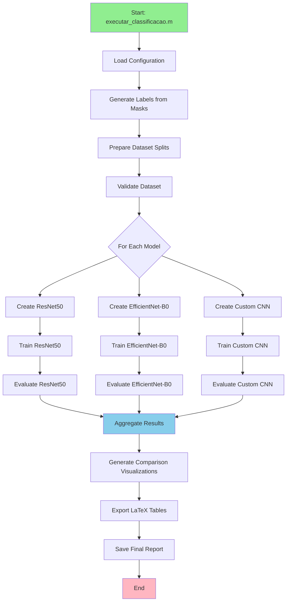

# Design Document

## Overview

The Corrosion Classification System is a deep learning-based solution for automated severity assessment of corrosion in ASTM A572 Grade 50 steel structures. The system leverages the existing segmentation dataset infrastructure and converts pixel-level annotations into image-level severity classifications. This design enables rapid triage capabilities while maintaining integration with the proven segmentation workflow.

### Key Design Principles

1. **Reusability**: Maximize reuse of existing infrastructure (ErrorHandler, VisualizationHelper, DataTypeConverter)
2. **Modularity**: Independent components for label generation, training, evaluation, and visualization
3. **Extensibility**: Easy addition of new model architectures and evaluation metrics
4. **Automation**: Single-command execution from data preparation to final results
5. **Publication-Ready**: Automatic generation of LaTeX tables and high-quality figures

### System Context

The classification system operates as a complementary tool to the existing U-Net/Attention U-Net segmentation pipeline. It processes the same RGB images but produces categorical severity labels instead of pixel-level masks, enabling faster inference for inspection triage workflows.

## Architecture

### High-Level Architecture

```
┌─────────────────────────────────────────────────────────────┐
│                  Corrosion Classification System             │
├─────────────────────────────────────────────────────────────┤
│                                                               │
│  ┌──────────────┐      ┌──────────────┐      ┌───────────┐ │
│  │   Label      │──────▶│   Dataset    │──────▶│  Training │ │
│  │  Generator   │      │  Preparation │      │  Pipeline │ │
│  └──────────────┘      └──────────────┘      └───────────┘ │
│         │                      │                     │       │
│         │                      │                     ▼       │
│         │                      │              ┌───────────┐ │
│         │                      │              │   Model   │ │
│         │                      │              │  Registry │ │
│         │                      │              └───────────┘ │
│         │                      │                     │       │
│         ▼                      ▼                     ▼       │
│  ┌──────────────────────────────────────────────────────┐  │
│  │           Evaluation & Visualization Module          │  │
│  └──────────────────────────────────────────────────────┘  │
│                              │                              │
│                              ▼                              │
│                    ┌──────────────────┐                    │
│                    │  Results Export  │                    │
│                    │  (LaTeX/Figures) │                    │
│                    └──────────────────┘                    │
└─────────────────────────────────────────────────────────────┘
```


### Component Architecture

The system consists of six primary components organized under `src/classification/`:

1. **LabelGenerator**: Converts segmentation masks to severity labels
2. **DatasetManager**: Handles data loading, splitting, and augmentation
3. **ModelFactory**: Creates and configures classification architectures
4. **TrainingEngine**: Manages training loops and checkpointing
5. **EvaluationEngine**: Computes metrics and generates reports
6. **VisualizationEngine**: Creates publication-quality figures

## Components and Interfaces

### 1. LabelGenerator

**Purpose**: Convert binary segmentation masks into categorical severity labels based on corroded area percentage.

**Class Definition**:
```matlab
classdef LabelGenerator < handle
    properties (Access = private)
        thresholds  % [light_threshold, moderate_threshold, severe_threshold]
        errorHandler
    end
    
    methods (Static)
        labels = generateLabelsFromMasks(maskDir, outputCSV, thresholds)
        percentage = computeCorrodedPercentage(mask)
        class = assignSeverityClass(percentage, thresholds)
    end
end
```

**Key Methods**:
- `generateLabelsFromMasks(maskDir, outputCSV, thresholds)`: Batch processes all masks
  - Input: Directory with binary masks, output CSV path, threshold array [10, 30]
  - Output: CSV with columns [filename, corroded_percentage, severity_class]
  - Process: Iterate masks → compute percentage → assign class → save CSV

- `computeCorrodedPercentage(mask)`: Calculates corroded area
  - Input: Binary mask (0=background, 255=corrosion)
  - Output: Percentage of corroded pixels (0-100)
  - Formula: (sum(mask > 0) / numel(mask)) * 100


- `assignSeverityClass(percentage, thresholds)`: Maps percentage to class
  - Input: Corroded percentage, threshold array
  - Output: Integer class (0=None/Light, 1=Moderate, 2=Severe)
  - Logic: if % < 10 → 0; if 10 ≤ % < 30 → 1; if % ≥ 30 → 2

**Integration**: Uses ErrorHandler for logging conversion statistics and warnings.

### 2. DatasetManager

**Purpose**: Load images, apply labels, split data, and provide data augmentation.

**Class Definition**:
```matlab
classdef DatasetManager < handle
    properties (Access = private)
        imageDir
        labelCSV
        splitRatios  % [train, val, test] e.g., [0.7, 0.15, 0.15]
        augmentationConfig
        errorHandler
    end
    
    methods
        obj = DatasetManager(imageDir, labelCSV, config)
        [trainDS, valDS, testDS] = prepareDatasets()
        stats = getDatasetStatistics()
        augDS = applyAugmentation(datastore)
    end
end
```

**Key Methods**:
- `prepareDatasets()`: Creates stratified train/val/test splits
  - Loads images and labels from CSV
  - Performs stratified split to maintain class balance
  - Returns three imageDatastore objects with labels
  - Validates that all images have corresponding labels

- `getDatasetStatistics()`: Generates distribution report
  - Counts samples per class in each split
  - Computes class balance ratios
  - Returns struct with statistics for logging


- `applyAugmentation(datastore)`: Configures data augmentation
  - Applies random horizontal/vertical flips
  - Random rotation (-15° to +15°)
  - Random brightness/contrast adjustment
  - Returns augmentedImageDatastore

**Integration**: Uses existing PreprocessingValidator for image validation.

### 3. ModelFactory

**Purpose**: Create and configure deep learning classification models with transfer learning.

**Class Definition**:
```matlab
classdef ModelFactory < handle
    methods (Static)
        net = createResNet50(numClasses, inputSize)
        net = createEfficientNetB0(numClasses, inputSize)
        net = createCustomCNN(numClasses, inputSize)
        net = configureTransferLearning(net, numClasses)
    end
end
```

**Supported Architectures**:

1. **ResNet50**:
   - Base: Pre-trained on ImageNet
   - Modification: Replace final FC layer with new FC(numClasses)
   - Input size: 224×224×3
   - Parameters: ~25M

2. **EfficientNet-B0**:
   - Base: Pre-trained on ImageNet
   - Modification: Replace classification head
   - Input size: 224×224×3
   - Parameters: ~5M (more efficient)

3. **Custom CNN**:
   - Architecture: 4 conv blocks + 2 FC layers
   - Conv blocks: [Conv → BatchNorm → ReLU → MaxPool]
   - Filters: [32, 64, 128, 256]
   - Designed for smaller datasets
   - Parameters: ~2M


**Transfer Learning Strategy**:
- Freeze early layers (feature extraction)
- Fine-tune last 2-3 blocks
- Train new classification head from scratch
- Use lower learning rate for pre-trained layers

### 4. TrainingEngine

**Purpose**: Execute training loops with monitoring, checkpointing, and early stopping.

**Class Definition**:
```matlab
classdef TrainingEngine < handle
    properties (Access = private)
        model
        trainingOptions
        errorHandler
        checkpointDir
    end
    
    methods
        obj = TrainingEngine(model, config)
        [trainedNet, history] = train(trainDS, valDS)
        plotTrainingHistory(history)
        saveCheckpoint(net, epoch, metrics)
    end
end
```

**Training Configuration**:
```matlab
trainingOptions = struct(...
    'MaxEpochs', 50, ...
    'MiniBatchSize', 32, ...
    'InitialLearnRate', 1e-4, ...
    'LearnRateSchedule', 'piecewise', ...
    'LearnRateDropFactor', 0.1, ...
    'LearnRateDropPeriod', 10, ...
    'ValidationFrequency', 50, ...
    'ValidationPatience', 10, ...
    'Shuffle', 'every-epoch', ...
    'Verbose', true, ...
    'Plots', 'training-progress' ...
);
```

**Key Features**:
- Early stopping based on validation loss plateau
- Learning rate scheduling (reduce on plateau)
- Checkpoint saving (best model + last epoch)
- Training history logging (loss, accuracy per epoch)


### 5. EvaluationEngine

**Purpose**: Compute comprehensive metrics and generate evaluation reports.

**Class Definition**:
```matlab
classdef EvaluationEngine < handle
    properties (Access = private)
        model
        testDatastore
        classNames
        errorHandler
    end
    
    methods
        obj = EvaluationEngine(model, testDS, classNames)
        metrics = computeMetrics()
        confMat = generateConfusionMatrix()
        [fpr, tpr, auc] = computeROC()
        inferenceTime = measureInferenceSpeed(numSamples)
        report = generateEvaluationReport()
    end
end
```

**Metrics Computed**:

1. **Overall Metrics**:
   - Accuracy: (TP + TN) / Total
   - Macro-averaged F1: Mean of per-class F1 scores
   - Weighted F1: Class-weighted average

2. **Per-Class Metrics**:
   - Precision: TP / (TP + FP)
   - Recall: TP / (TP + FN)
   - F1-Score: 2 × (Precision × Recall) / (Precision + Recall)

3. **Confusion Matrix**:
   - Rows: True labels
   - Columns: Predicted labels
   - Normalized by row (percentage per true class)

4. **ROC Analysis**:
   - One-vs-Rest strategy for multi-class
   - AUC score per class
   - Micro and macro-averaged ROC curves

5. **Performance Metrics**:
   - Average inference time per image (ms)
   - Throughput (images/second)
   - Memory usage during inference


### 6. VisualizationEngine

**Purpose**: Generate publication-quality figures and LaTeX tables.

**Class Definition**:
```matlab
classdef VisualizationEngine < handle
    properties (Access = private)
        outputDir
        visualizationHelper  % Reuse existing helper
    end
    
    methods (Static)
        plotConfusionMatrix(confMat, classNames, filename)
        plotTrainingCurves(histories, modelNames, filename)
        plotROCCurves(rocData, classNames, filename)
        plotInferenceComparison(times, modelNames, filename)
        generateLatexTable(metrics, filename)
        exportAllFigures(figHandles, outputDir)
    end
end
```

**Figure Specifications**:

1. **Confusion Matrix Heatmap**:
   - Size: 8×6 inches
   - Colormap: Blues
   - Annotations: Percentage values
   - Format: PNG (300 DPI) + PDF (vector)

2. **Training Curves**:
   - Subplots: [Loss, Accuracy]
   - Lines: Train (solid), Validation (dashed)
   - Legend: Model names
   - Grid: On

3. **ROC Curves**:
   - One curve per class
   - Diagonal reference line
   - AUC values in legend
   - Axis labels: FPR, TPR

4. **Inference Time Comparison**:
   - Bar chart with error bars
   - X-axis: Model names
   - Y-axis: Time (ms)
   - Horizontal line: Real-time threshold

**LaTeX Export**:
- Metrics table: `\begin{table}...\end{table}`
- Confusion matrix: Formatted with booktabs
- Figure captions: Auto-generated descriptions


## Data Models

### Label CSV Format

```csv
filename,corroded_percentage,severity_class
img001.jpg,5.23,0
img002.jpg,18.47,1
img003.jpg,42.91,2
```

**Fields**:
- `filename`: Image filename (string)
- `corroded_percentage`: Percentage of corroded pixels (float, 0-100)
- `severity_class`: Integer class label (0, 1, or 2)

### Configuration Structure

```matlab
config = struct(...
    'paths', struct(...
        'imageDir', 'img/original', ...
        'maskDir', 'img/masks', ...
        'outputDir', 'output/classification', ...
        'checkpointDir', 'output/classification/checkpoints' ...
    ), ...
    'labelGeneration', struct(...
        'thresholds', [10, 30], ...
        'outputCSV', 'output/classification/labels.csv' ...
    ), ...
    'dataset', struct(...
        'splitRatios', [0.7, 0.15, 0.15], ...
        'inputSize', [224, 224], ...
        'augmentation', true ...
    ), ...
    'training', struct(...
        'maxEpochs', 50, ...
        'miniBatchSize', 32, ...
        'initialLearnRate', 1e-4, ...
        'validationPatience', 10 ...
    ), ...
    'models', {{'ResNet50', 'EfficientNetB0', 'CustomCNN'}}, ...
    'evaluation', struct(...
        'generateROC', true, ...
        'generateConfusionMatrix', true, ...
        'measureInferenceTime', true ...
    ) ...
);
```


### Training History Structure

```matlab
history = struct(...
    'epoch', [1, 2, 3, ...], ...
    'trainLoss', [0.85, 0.62, 0.48, ...], ...
    'valLoss', [0.91, 0.68, 0.55, ...], ...
    'trainAccuracy', [0.65, 0.78, 0.85, ...], ...
    'valAccuracy', [0.62, 0.75, 0.82, ...], ...
    'learningRate', [1e-4, 1e-4, 1e-5, ...], ...
    'timestamp', datetime('now') ...
);
```

### Evaluation Results Structure

```matlab
results = struct(...
    'modelName', 'ResNet50', ...
    'accuracy', 0.92, ...
    'macroF1', 0.91, ...
    'weightedF1', 0.92, ...
    'perClassMetrics', struct(...
        'class0', struct('precision', 0.95, 'recall', 0.93, 'f1', 0.94), ...
        'class1', struct('precision', 0.88, 'recall', 0.90, 'f1', 0.89), ...
        'class2', struct('precision', 0.92, 'recall', 0.91, 'f1', 0.91) ...
    ), ...
    'confusionMatrix', [45, 2, 1; 3, 38, 2; 1, 2, 42], ...
    'rocAUC', struct('class0', 0.98, 'class1', 0.95, 'class2', 0.97), ...
    'inferenceTime', 12.5, ...  % milliseconds
    'memoryUsage', 1024 ...     % MB
);
```

## Error Handling

### Error Categories

1. **Data Validation Errors**:
   - Missing images or masks
   - Corrupted image files
   - Invalid mask values (not binary)
   - Mismatched image-mask pairs

2. **Training Errors**:
   - Out of memory during training
   - NaN/Inf loss values
   - Model divergence
   - Checkpoint save failures

3. **Evaluation Errors**:
   - Invalid predictions
   - Metric computation failures
   - Visualization generation errors


### Error Handling Strategy

**Using Existing ErrorHandler**:
```matlab
% Initialize error handler
errorHandler = ErrorHandler.getInstance();
errorHandler.setLogFile('classification_log.txt');

% Log operations
errorHandler.logInfo('Starting label generation...');
errorHandler.logWarning('Class imbalance detected: Class 0 has 60% of samples');
errorHandler.logError('Failed to load image: img042.jpg');

% Try-catch with fallback
try
    net = trainNetwork(trainDS, layers, options);
catch ME
    errorHandler.logError(['Training failed: ' ME.message]);
    errorHandler.logInfo('Attempting to resume from last checkpoint...');
    net = loadCheckpoint(checkpointDir);
end
```

**Validation Checks**:
- Pre-training: Validate all images load correctly
- During training: Monitor for NaN/Inf values
- Post-training: Verify model outputs are valid probabilities
- Before evaluation: Check test set integrity

## Testing Strategy

### Unit Tests

**Test Coverage**:

1. **LabelGenerator Tests** (`test_LabelGenerator.m`):
   - Test corroded percentage calculation with synthetic masks
   - Test class assignment with boundary values (9.9%, 10.0%, 29.9%, 30.0%)
   - Test CSV generation and format validation
   - Test error handling for invalid masks

2. **DatasetManager Tests** (`test_DatasetManager.m`):
   - Test stratified split maintains class balance
   - Test augmentation pipeline produces valid images
   - Test dataset statistics computation
   - Test handling of missing files

3. **ModelFactory Tests** (`test_ModelFactory.m`):
   - Test each architecture creates valid network
   - Test transfer learning configuration
   - Test output layer has correct number of classes
   - Test input size compatibility


4. **EvaluationEngine Tests** (`test_EvaluationEngine.m`):
   - Test metric computation with known predictions
   - Test confusion matrix generation
   - Test ROC curve computation
   - Test inference time measurement

### Integration Tests

**Test Scenarios**:

1. **End-to-End Pipeline** (`test_full_pipeline.m`):
   - Generate synthetic dataset (10 images per class)
   - Run complete workflow: label generation → training → evaluation
   - Verify all outputs are created
   - Validate output formats

2. **Model Comparison** (`test_model_comparison.m`):
   - Train all three architectures on same data
   - Compare metrics across models
   - Verify comparative visualizations are generated

3. **Integration with Existing Code** (`test_integration.m`):
   - Test ErrorHandler integration
   - Test VisualizationHelper reuse
   - Test configuration system compatibility

### Performance Tests

**Benchmarks**:

1. **Inference Speed**:
   - Target: < 50ms per image (ResNet50)
   - Target: < 30ms per image (EfficientNet-B0)
   - Target: < 20ms per image (Custom CNN)

2. **Training Time**:
   - Baseline: 100 images, 50 epochs
   - Expected: < 30 minutes (with GPU)

3. **Memory Usage**:
   - Training: < 8GB GPU memory
   - Inference: < 2GB GPU memory


## Workflow Diagram



## Directory Structure

```
src/classification/
├── core/
│   ├── LabelGenerator.m
│   ├── DatasetManager.m
│   ├── ModelFactory.m
│   ├── TrainingEngine.m
│   ├── EvaluationEngine.m
│   └── VisualizationEngine.m
├── models/
│   ├── ResNet50Classifier.m
│   ├── EfficientNetClassifier.m
│   └── CustomCNNClassifier.m
├── utils/
│   ├── ClassificationConfig.m
│   └── MetricsCalculator.m
└── README.md

output/classification/
├── labels.csv
├── checkpoints/
│   ├── resnet50_best.mat
│   ├── efficientnet_best.mat
│   └── customcnn_best.mat
├── results/
│   ├── resnet50_results.mat
│   ├── efficientnet_results.mat
│   └── customcnn_results.mat
├── figures/
│   ├── confusion_matrix_resnet50.png
│   ├── confusion_matrix_resnet50.pdf
│   ├── training_curves_comparison.png
│   ├── roc_curves_resnet50.png
│   └── inference_time_comparison.png
├── latex/
│   ├── metrics_table.tex
│   ├── confusion_matrix_table.tex
│   └── results_summary.tex
└── logs/
    └── classification_YYYY-MM-DD_HH-MM-SS.txt
```


## Implementation Phases

### Phase 1: Label Generation and Dataset Preparation
- Implement LabelGenerator class
- Create label generation script
- Implement DatasetManager class
- Validate dataset splits and statistics

### Phase 2: Model Architecture Implementation
- Implement ModelFactory class
- Create ResNet50 classifier
- Create EfficientNet-B0 classifier
- Create Custom CNN classifier
- Test each architecture independently

### Phase 3: Training Pipeline
- Implement TrainingEngine class
- Configure training options
- Implement checkpointing system
- Test training loop with synthetic data

### Phase 4: Evaluation System
- Implement EvaluationEngine class
- Implement metrics calculation
- Implement confusion matrix generation
- Implement ROC curve computation
- Test evaluation with known predictions

### Phase 5: Visualization and Export
- Implement VisualizationEngine class
- Create figure generation functions
- Implement LaTeX export functions
- Test all visualizations

### Phase 6: Integration and Automation
- Create executar_classificacao.m main script
- Integrate all components
- Add comprehensive error handling
- Create user documentation

### Phase 7: Testing and Validation
- Write unit tests for all components
- Write integration tests
- Perform end-to-end testing
- Benchmark performance

## Design Decisions and Rationale

### 1. Why Three Model Architectures?

**ResNet50**: Industry standard, proven performance, good baseline
**EfficientNet-B0**: Modern architecture, better efficiency, fewer parameters
**Custom CNN**: Lightweight, faster inference, optimized for specific task

This provides a comprehensive comparison of complexity vs performance trade-offs.

### 2. Why Stratified Splitting?

Ensures each severity class is proportionally represented in train/val/test sets, preventing bias and ensuring fair evaluation across all classes.


### 3. Why Transfer Learning?

Pre-trained ImageNet weights provide strong feature extractors for visual tasks. Fine-tuning is more efficient than training from scratch, especially with limited corrosion data.

### 4. Why Early Stopping?

Prevents overfitting by monitoring validation loss. Automatically stops training when model stops improving, saving computational resources.

### 5. Why Multiple Evaluation Metrics?

- **Accuracy**: Overall performance
- **Precision/Recall**: Class-specific performance
- **F1-Score**: Balanced metric for imbalanced classes
- **ROC/AUC**: Threshold-independent performance
- **Confusion Matrix**: Detailed error analysis

Comprehensive metrics provide complete understanding of model behavior.

### 6. Why Reuse Existing Infrastructure?

- **Proven reliability**: ErrorHandler, VisualizationHelper already tested
- **Consistency**: Maintains code style and patterns
- **Efficiency**: Avoids reimplementing solved problems
- **Maintainability**: Single source of truth for common utilities

### 7. Why Automated LaTeX Export?

Streamlines research article preparation, reduces manual transcription errors, ensures consistency between code results and paper figures.

## Dependencies

### MATLAB Toolboxes Required
- Deep Learning Toolbox
- Image Processing Toolbox
- Statistics and Machine Learning Toolbox
- Computer Vision Toolbox (for pre-trained models)

### External Dependencies
- Pre-trained model weights (downloaded automatically by MATLAB)

### Internal Dependencies
- `src/utils/ErrorHandler.m`
- `src/utils/VisualizationHelper.m`
- `src/utils/DataTypeConverter.m`
- `src/validation/PreprocessingValidator.m`

## Performance Considerations

### Memory Optimization
- Use mini-batch processing (batch size 32)
- Clear intermediate variables after use
- Use single precision (float32) for training
- Implement gradient checkpointing for large models

### Speed Optimization
- Use GPU acceleration when available
- Parallelize data loading with background workers
- Cache preprocessed images
- Use compiled MEX functions for bottlenecks

### Scalability
- Support for distributed training (future enhancement)
- Batch inference for multiple images
- Configurable model complexity based on hardware

## Security and Validation

### Input Validation
- Verify image file formats (jpg, png)
- Check image dimensions and channels
- Validate mask binary values (0 or 255)
- Ensure label CSV format correctness

### Output Validation
- Verify model predictions are valid probabilities (sum to 1)
- Check for NaN/Inf in metrics
- Validate figure generation success
- Ensure all expected files are created

## Future Enhancements

1. **Additional Architectures**: Vision Transformer (ViT), MobileNet
2. **Ensemble Methods**: Combine predictions from multiple models
3. **Explainability**: Grad-CAM visualizations for model interpretability
4. **Real-time Inference**: Optimized deployment pipeline
5. **Active Learning**: Identify uncertain samples for manual review
6. **Multi-label Classification**: Classify corrosion type + severity simultaneously
